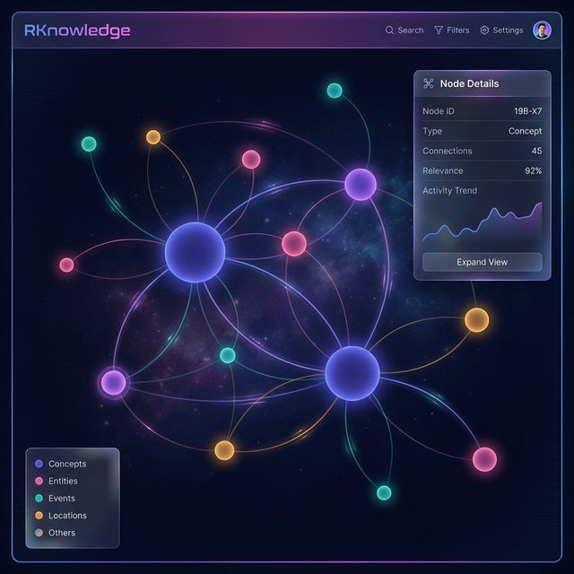

# 🧠 RKnowledge

[](https://github.com/Algiras/RKnowledge/actions/workflows/ci.yml)
[](https://github.com/Algiras/RKnowledge/releases)
[](LICENSE)

<p align="center">
  
</p>

Production-grade knowledge graph extraction CLI. Extract concepts and relationships from any document using LLMs, store in Neo4j, analyze with graph algorithms, and explore with interactive visualization.

**[Documentation](https://algiras.github.io/RKnowledge/)** · **[Architecture](ARCHITECTURE.md)** · **[Contributing](CONTRIBUTING.md)**

> Inspired by [rahulnyk/knowledge_graph](https://github.com/rahulnyk/knowledge_graph) — rewritten from scratch in Rust.

## How We Differ

| Dimension | [Original](https://github.com/rahulnyk/knowledge_graph) (Python) | RKnowledge (Rust) |
|---|---|---|
| **Interface** | Jupyter notebook | Full CLI, 10 subcommands |
| **LLM Providers** | Ollama only | Anthropic, OpenAI, Google, Ollama |
| **Concurrency** | Sequential | Parallel LLM calls (`-j` flag) |
| **Storage** | In-memory DataFrames | Neo4j graph DB (persistent) |
| **Incremental** | Rebuild from scratch | `--append` merges into existing graph |
| **Input Formats** | PDF only | PDF, Markdown, HTML, plain text |
| **Entity Typing** | 8 fixed categories | Free-form LLM classification |
| **Graph Analytics** | Degree + Louvain | PageRank, LPA communities, Dijkstra, density |
| **Querying** | None | `query`, `path`, `stats`, `communities` |
| **Visualization** | Static Pyvis | Interactive: click cards, search, toggles, legend |
| **Export** | None | JSON, CSV, GraphML, Cypher |
| **Tests** | None | 118 tests (107 unit + 11 integration) |
| **CI/CD** | None | GitHub Actions: lint, test, multi-platform build |
| **Distribution** | `docker build` + Jupyter | Single binary, curl install, skills.sh |

## Features

- **Multi-format**: PDF, Markdown, HTML, and plain text
- **Multi-provider LLM**: Anthropic, OpenAI, Google, Ollama (local/free)
- **Concurrent extraction**: Parallel LLM calls with `-j` flag
- **Smart entity typing**: LLM classifies freely ("programming language", "database", etc.)
- **Neo4j backend**: Persistent graph DB with Cypher, incremental `--append`
- **Graph analytics**: PageRank, community detection, shortest path, density
- **Interactive visualization**: Click cards, search, entity legend, toggle proximity edges
- **Multiple exports**: JSON, CSV, GraphML, Cypher
- **Fast**: Compiled Rust, single binary, zero runtime deps

## Installation

### One-liner

```bash
curl -fsSL https://raw.githubusercontent.com/Algiras/RKnowledge/main/install.sh | bash
```

### From Source

```bash
git clone https://github.com/Algiras/RKnowledge.git
cd RKnowledge
cargo build --release
cp target/release/rknowledge ~/.local/bin/
```

### As a Skill

```bash
npx skills add Algiras/RKnowledge
```

## Quick Start

```bash
# 1. Initialize configuration and start Neo4j
rknowledge init

# 2. Configure your LLM provider (interactive)
rknowledge auth

# 3. Build a knowledge graph from documents
rknowledge build ./docs/ --provider ollama -j 8

# 4. Explore
rknowledge query "machine learning" --depth 2
rknowledge path "docker" "kubernetes"
rknowledge stats
rknowledge communities
rknowledge viz
```

## Commands

| Command | Description |
|---------|-------------|
| `init` | Initialize config and start Neo4j via Docker |
| `auth` | Configure API keys for LLM providers (interactive) |
| `build <path>` | Process documents and build knowledge graph |
| `query <query>` | Search graph (natural language or `cypher:` prefix) with `--depth` |
| `path <from> <to>` | Find shortest path between two concepts |
| `stats` | Graph analytics: PageRank, density, degree distribution, entity types |
| `communities` | List detected communities and their members |
| `export` | Export to JSON, CSV, GraphML, or Cypher |
| `viz` | Open interactive visualization in browser |

### Build Options

```bash
rknowledge build ./docs \
  --provider ollama \          # anthropic, openai, ollama, google
  --model mistral \            # provider-specific model name
  --output neo4j \             # neo4j, json, csv
  -j 8 \                       # concurrent LLM requests
  --append \                   # merge into existing graph
  --chunk-size 1500 \          # text chunk size (chars)
  --chunk-overlap 150          # overlap between chunks
```

### Query Examples

```bash
# Natural language search with depth
rknowledge query "machine learning" --depth 2

# Shortest path between concepts
rknowledge path "docker" "kubernetes"

# Graph statistics and analytics
rknowledge stats

# Community detection
rknowledge communities

# Direct Cypher query
rknowledge query "cypher: MATCH (n:Concept) RETURN n.label, n.degree ORDER BY n.degree DESC LIMIT 10"
```

## Configuration

Configuration is stored at `~/<config_dir>/rknowledge/config.toml`:

```toml
default_provider = "ollama"
default_model = "mistral"
chunk_size = 1500
chunk_overlap = 150

[providers.anthropic]
api_key = "${ANTHROPIC_API_KEY}"
model = "claude-sonnet-4-20250514"

[providers.openai]
api_key = "${OPENAI_API_KEY}"
model = "gpt-4o"

[providers.ollama]
base_url = "http://localhost:11434"
model = "mistral"

[providers.google]
api_key = "${GOOGLE_API_KEY}"
model = "gemini-pro"

[neo4j]
uri = "bolt://localhost:7687"
user = "neo4j"
password = "rknowledge"
database = "neo4j"
```

## LLM Providers

| Provider | Setup | Best For |
|----------|-------|----------|
| **Ollama** | `ollama run mistral` | Free, local, private data |
| **Anthropic** | `export ANTHROPIC_API_KEY=...` | Highest quality extraction |
| **OpenAI** | `export OPENAI_API_KEY=...` | Good balance of quality/speed |
| **Google** | `export GOOGLE_API_KEY=...` | Gemini models |

## Architecture

```
┌──────────────────────────────────────────────────────────────────────┐
│                         CLI (clap)                                    │
├────────┬──────┬────────┬────────┬──────┬────────┬────────┬───────────┤
│  init  │ auth │ build  │ query  │ path │ stats  │ comm.  │ viz/export│
├────────┴──────┴────────┴────────┴──────┴────────┴────────┴───────────┤
│                                                                       │
│  ┌────────────┐  ┌────────────────┐  ┌──────────────────────────┐    │
│  │   Parser   │  │   LLM Client   │  │     Graph Builder        │    │
│  │ PDF/MD/HTML│→ │ 4 providers    │→ │ petgraph + community     │    │
│  │ + Chunker  │  │ concurrent -j  │  │ + entity typing          │    │
│  └────────────┘  └────────────────┘  └──────────────────────────┘    │
│                                               │                       │
│  ┌────────────┐  ┌────────────────┐  ┌───────┴──────────────────┐    │
│  │ Analytics  │  │   Storage      │  │     Visualization        │    │
│  │ PageRank   │  │   Neo4j        │  │   vis-network + cards    │    │
│  │ Dijkstra   │  │   Docker       │  │   search + legend        │    │
│  │ LPA comm.  │  │   MERGE/append │  │   type coloring          │    │
│  └────────────┘  └────────────────┘  └──────────────────────────┘    │
│                                                                       │
│  ┌──────────────────────────────────────────────────────────────┐    │
│  │                    Export Layer                               │    │
│  │              JSON  ·  CSV  ·  GraphML  ·  Cypher             │    │
│  └──────────────────────────────────────────────────────────────┘    │
└──────────────────────────────────────────────────────────────────────┘
```

See [ARCHITECTURE.md](ARCHITECTURE.md) for the full deep-dive.

## How It Works

1. **Document Parsing**: Documents are loaded and converted to plain text (PDF, MD, HTML, TXT)
2. **Chunking**: Text is split into overlapping chunks (default 1500 chars)
3. **LLM Extraction**: Chunks are sent concurrently to the LLM to extract `(concept, type, concept, type, relationship)` tuples
4. **Graph Building**: Concepts become typed nodes, relationships become weighted edges
5. **Contextual Proximity**: Concepts in the same chunk get additional weighted edges
6. **Community Detection**: Label Propagation groups related concepts
7. **Storage**: Graph is stored in Neo4j via `MERGE` for safe incremental updates

## Neo4j Access

After `rknowledge init`, Neo4j is available at:
- **Browser**: http://localhost:7474
- **Bolt**: bolt://localhost:7687
- **Credentials**: neo4j / rknowledge

## Development

```bash
cargo test                  # Run tests (118 total)
cargo clippy -- -D warnings # Lint (CI enforced)
cargo fmt                   # Format
RUST_LOG=debug cargo run -- build ./demo_data  # Debug logging
```

See [CONTRIBUTING.md](CONTRIBUTING.md) for the full development guide.

## License

MIT

## Credits

Inspired by [rahulnyk/knowledge_graph](https://github.com/rahulnyk/knowledge_graph).
